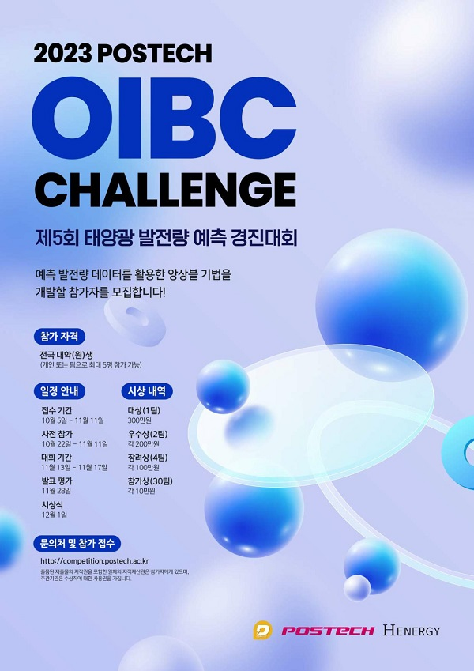

# 2023_POSTECH_OIBC

    

[2023 POSTECH OIBC CHALLENGE 제5회 태양광 발전량 예측 경진대회](https://o.solarkim.com/cmpt2023)에서 대상:trophy: (1등 / 150팀)을 받은 仁義禮智信팀의 발표 자료입니다.
- [이형권](https://github.com/lhk6565) (산업공학과)
- ㅇㅇㅇ (시스템경영공학과)
- ㅇㅇㅇ (시스템경영공학과)
- ㅇㅇㅇ (시스템경영공학과)
- 최승준 (수학과)

## 대회 소개
- 기술로 전력 시장을 개방하는 **H Energy**와 **POSTECH 오픈이노베이션 빅데이터 센터(OIBC) 및 미래도시 연구센터(FOIC)**, **산업 인공지능 프로그램**이 함께 미래 전력 시장을 이끌어갈 인재를 발굴, 지원하기 위해 대학 및 대학원생 대상으로 제5회 OIBC CHALLENGE를 주최
- 다종 태양광 발전 예측 모형의 앙상블 활용 방안 개발

## 대회 기간
- 2023년 10월 22일 ~ 2023년 11월 11일: 사전 대회 기간
- 2023년 11월 13일 ~ 2023년 11월 17일: 경진 대회 기간
- 2023년 11월 28일: 온라인 발표 평가
- 2023년 12월 01일: 시상식

## 대회 미션
- "기 개발된 5종의 태양광 발전량 예측 모형들은 그 특성들이 달라 시간대별 예측 성능에 장단점이 존재함. 이러한 다종 예측 모형들의 특성을 파악 및 활용하여 예측 성능 향상이 가능한 앙상블 기법을 개발하고자 함."

## 대회 규칙
1. 대회 기간 동안의 태양광 발전소의 시간 별 발전량을 전날 10시와 17시 각각 총 두 번 API를 통해 매일 입력
2. 예측된 발전량을 입력
3. 입력한 태양광 발전량 양은 변경할 수 있으며, 최종 입력된 발전량을 기준으로 평가
4. 전날 10시, 17시 예측된 발전량의 평균과 실제 발전량의 차이를 비교하여 시간대별 예측오차율을 아래와 같이 평가
$$\frac{\left|\frac{\hat{G}_h^{10}+\hat{G}_h^{17}}{2}-G_h\right|}{C}\times 100$$
$C$ : 태양광 발전소 용량 (kw)  
$G_h$ : 태양광 발전소 $h$ 시간대 실제 발전량  
$\hat{G}_h^n$ : 전날 $n$시에 입력한 $h$ 시간대 발전량 예측값  

5. 예측 인센티브 (정산금) 산정  
예측 인센티브는 시간대별 예측오차율에 따라 아래와 같이 산정  
&nbsp;&nbsp;&nbsp;&nbsp;&nbsp;&nbsp;&nbsp;&nbsp;\- 시간대별 예측오차율 6% 이하 : $I_n$ = 4원/kWh  
&nbsp;&nbsp;&nbsp;&nbsp;&nbsp;&nbsp;&nbsp;&nbsp;\- 시간대별 예측오차율 6% 초과 ~ 8% 이하 : $I_n$ = 3원/kWh  
&nbsp;&nbsp;&nbsp;&nbsp;&nbsp;&nbsp;&nbsp;&nbsp;\- 시간대별 예측오차율 8% 이상 : $I_n$ = 0원/kWh  
예측 일자의 정산금은 아래와 같이 (발전소의 시간대별 발전량 $\times$ 인센티브)의 합으로 계산
$$\sum_{h=1}^{24}G_h \times I_n$$
$G_h$ : 태양광 발전소 $h$ 시간대 실제 발전량  
$I_h$ : $h$ 시간대의 예측 인센티브  
단, 설비 이용률 10% 미만 시 오차율 산정에서 제외되어 인센티브는 지급되지 않음  
(설비 이용률 : 태양광 발전소 용량 중 실제 발전량 비율)  

6. 대회 기간 동안의 총 예측 인센티브 (정산금) 합이 높을수록 우수한 것으로 평가

<주의>  
\- 발전이 없는 시간대에도 예측값을 입력해야 함  
\- 해당 시간까지 한차례도 예측값을 입력하지 않으면 모든 시간대에 대해서 0kWh로 입력한 것으로 간주

## 제안 방법
- 다변량 모델과 시계열 모델을 hybrid 하여 $y^{''} = f(y^{'}t)$를 사용하여 문제를 해결하고자 제안
- 자세한 내용은 [발표 자료](Duck_Curve_한국공학대학교.pdf) 참고 바람

## 코드 실행
- `Process` 폴더 내 필요한 `.ipynb` 파일을 실행하면 됩니다. `Data Processing.ipynb` 파일은 api로 가져온 데이터를 전처리 하기 위한 파일이며 해당 부분은 대회 종료 후 코드를 삭제하여 일부분만 정리되어 있습니다.
- 디렉토리 구성 :
~~~
    - Data Processing.ipynb         # 데이터 전처리
    - EDA.ipynb                     # EDA 및 시각화
    - ML.ipynb                      # 모델링
    - api_sample.py                 # 데이터 취득 및 입찰 API
    - functions.py                  # 사용자 정의 모듈
~~~

## 느낀점
이번 대회에서 사전 참여 기간을 통해 모델을 만들고 error값을 확인해 봤어야 했는데 이 기간을 활용 못 하고 대회 전날 부터 밤을 새워 전처리 부터 모델링까지 해야 했어서 매우 아쉽다.(이래서 1~2일차에 error값이 높게 나왔다...) 
Boosting 계열 ML모델에 Moving Average를 결합하니 생각지도 못하게 오차가 줄어 들었고, Physics 모델과도 hybrid를 할 수 있으면 좀 더 정확한 예측이 가능하지 않을까 싶다. 
전처리 과정에서 시공간(Spatio-Temporal)을 활용하여 기후 유사도를 Clustering 한다면 좀 더 유의미한 결과를 얻을 수 있지 않았을까? 이에 대해서는 이번에 알게된 Spatio-Temporal Analysis에 대한 공부가 좀 필요할 것 같다. 
경진대회 진행하면서 계속 정확도를 높이려고 하루도 빠짐 없이 밤을 새웠는데 세상에 강자는 많다고 다른 팀들도 열심히 참여하는 것이 보였다. 매년 주제가 조금씩 바뀌는 것 같지만 2023년에도 OIBC CHALLENGE가 열린다면 한번 더 도전해 볼 것이다.

## 문의
코드 및 발표자료에 대해 궁금한 점이 있으실 경우 lhk6565@naver.com으로 문의해주시면 답변드리겠습니다.:blush: 
데이터에 대한 저작권은 대회 주관사인 [POSTECH 오픈이노베이션 빅데이터센터 (OIBC)](http://oibc.postech.ac.kr/)에 있으므로 해당 주관사로 문의 부탁드립니다.